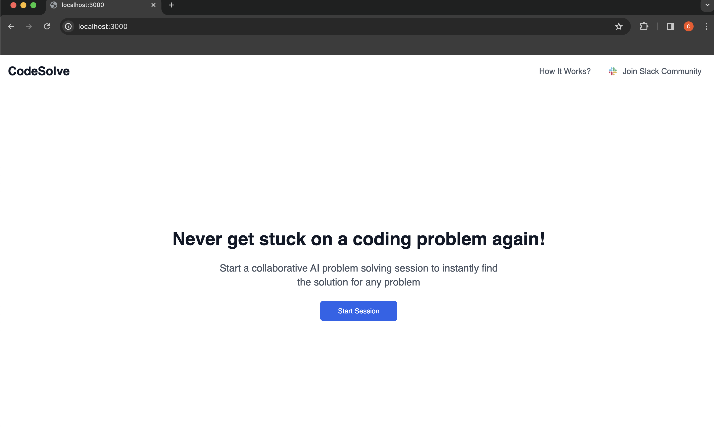
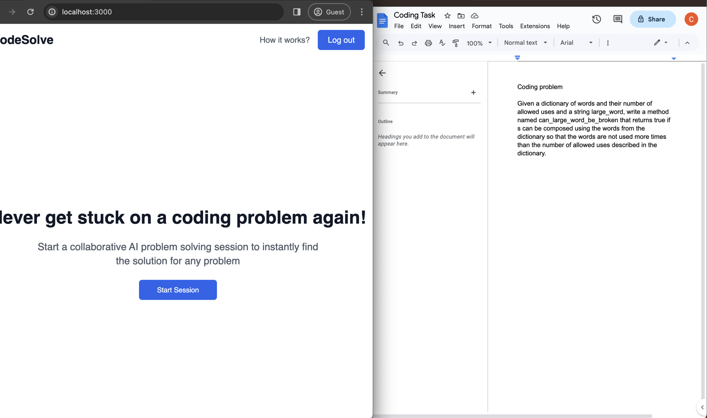
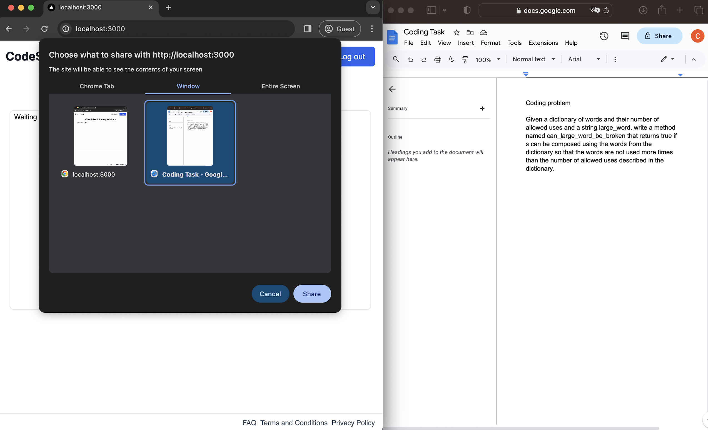
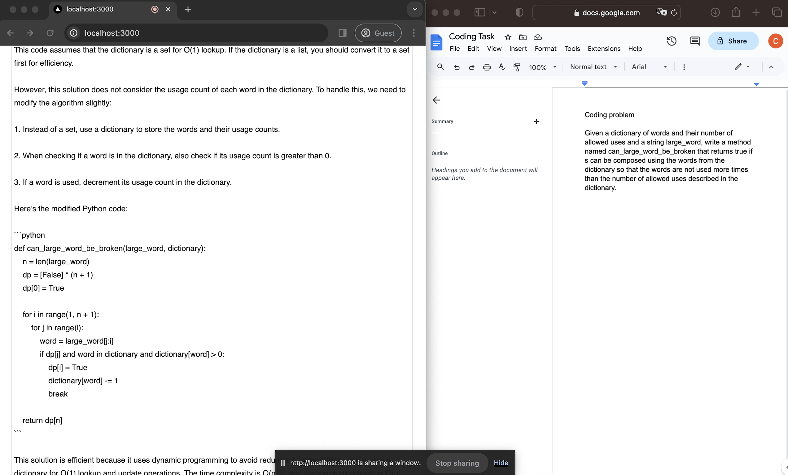

## How to run

### 1) Install dependencies

```bash
npm install
```

### 2) Populate API keys in .env.local

```
REPLICATE_API_TOKEN='<INSERT_API_TOKEN>'
OPENAI_API_KEY='<INSERT_API_TOKEN>'
```

To get openai API token, create an account here: https://openai.com

To get a replicate API token create an account here:
https://replicate.com


### 3) Run server
```bash
npm run dev
```

### 4) Navigate to localhost

Open [http://localhost:3000](http://localhost:3000) with your browser to see the result.



IMPORTANT: The web app has only been tested and QA'd on Chrome with Incognito Mode so open localhost:3000 on Chrome with Incognito Mode for best results.

If you are using a different browser or you don't have Incognito Mode on and you are getting an error, try again on Chrome with Incognito Mode to resolve the issue. This is because some other browsers and extensions might interfere with screen sharing permissions.

### 5) Split screen in two

Split your screen in half with left half the window with CodeAssist and right half the window in which you are working on coding tasks.



### 6) Start session

Start session and share the right screen so that CodeAssist can automatically detect coding problems and present solutions.



### 7) See AI answers automatically appear on screen




## Next Steps
1. Allow user to select from more models like Llama 2
2. Implement answer generation for questions detected through audio

## Troubleshooting

To troubleshoot or report bugs, join the CodeAssist Community on Slack with the following invitation link:
https://join.slack.com/t/codeassistcommunity/shared_invite/zt-2dewvxtjl-caGDjW~fOYtODFNeFBlssA

If the invitation link has expired or if you have other questions, reach out to:
support@tegu.ai